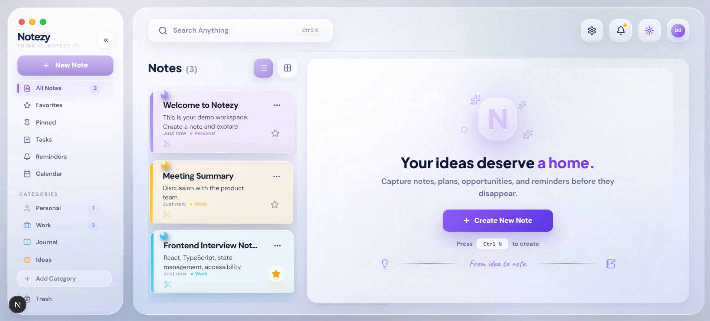
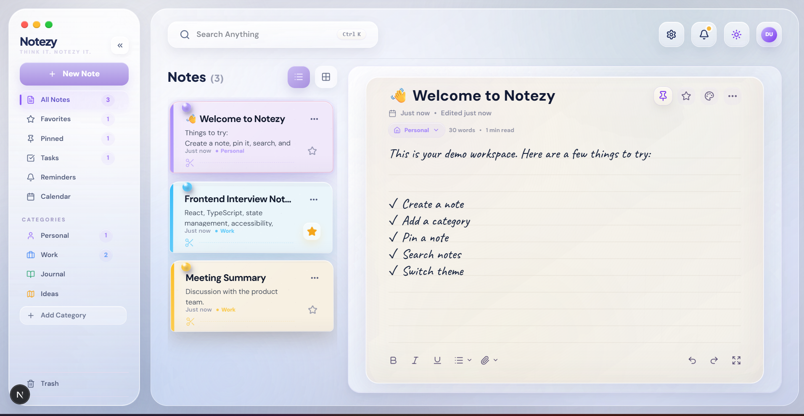
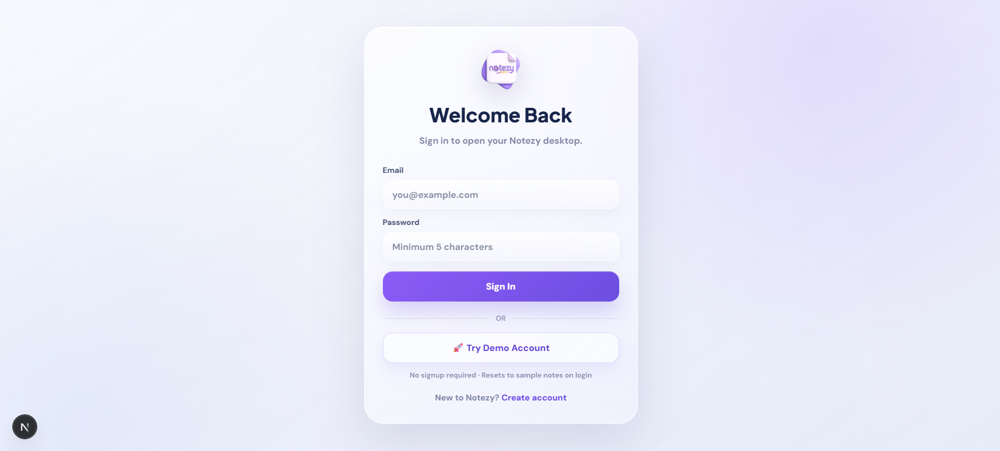
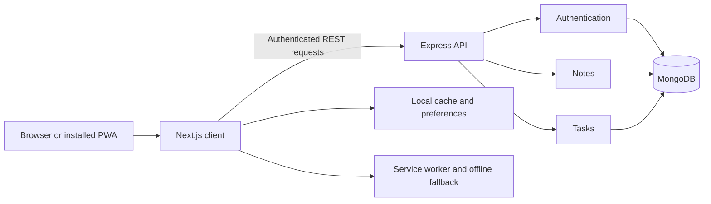

# Notezy

> A polished personal productivity workspace for connected notes, tasks, reminders, and planning.

[](https://nextjs.org/)
[](https://www.typescriptlang.org/)
[](https://www.mongodb.com/)
[](https://expressjs.com/)

Notezy combines a rich note editor with a dedicated task workspace. Notes and tasks share categories, search, related-note links, responsive navigation, themes, and persistent MongoDB storage.

[**Live Demo**](https://notezy-app.vercel.app/) · [**Demo Login**](https://notezy-app.vercel.app/login) · [**Source Code**](https://github.com/sammy00/Notezy)

## Highlights

- Secure email/password authentication with JWT sessions
- Password recovery with hashed, single-use reset tokens
- One-click demo workspace with seeded sample content
- Rich-text notes with autosave, manual save, card colors, and offline cache
- Categories, favorites, pinned notes, trash, restore, and live counts
- Task workspace with List, Board, and Calendar views
- Today, Upcoming, Completed, Overdue, and Important task scopes
- Full-page task creation and editing with checklists and related notes
- Job Application template with a visual timeline, reminders, source, and company details
- Task templates that remain drafts until explicitly saved
- Checkbox completion plus Ctrl/Cmd-click or long-press multi-selection
- Bulk complete, priority, Today, and delete actions
- Workspace-wide note and task search
- Light and dark themes with matching toast and save-state colors
- Responsive mobile navigation, menu drawer, and stacked detail layouts
- Installable PWA with an offline fallback

## Screenshots

### Demo Workspace



### Rich Note Editor



### One-Click Demo Login



## Technology

| Layer | Technology |
| --- | --- |
| Client | Next.js 16, React 19, TypeScript, Tailwind CSS 4 |
| UI | Framer Motion, Lucide React |
| API | Node.js, Express 5, TypeScript |
| Data | MongoDB, Mongoose |
| Security | JWT, bcryptjs, express-validator |
| Email | Resend |

## Architecture



```text
notezy/
├── client/
│   ├── app/                  # Next.js routes and global styles
│   ├── components/           # Layout, authentication, and shared UI
│   ├── features/
│   │   ├── auth/             # Authentication client flows
│   │   ├── notes/            # Notes workspace and editor
│   │   └── tasks/            # Task views, templates, calendar, and API client
│   ├── public/               # PWA worker, icons, and backgrounds
│   └── shared/               # Theme and toast infrastructure
├── server/src/
│   ├── controllers/          # Auth, note, and task request handlers
│   ├── middleware/           # JWT authentication
│   ├── models/               # User, Note, and Task schemas
│   ├── routes/               # REST route definitions
│   └── services/             # Authentication and note business logic
└── docs/screenshots/         # README media
```

## Local Development

### Requirements

- Node.js 20 or newer
- npm
- Local or hosted MongoDB

### Install

```bash
git clone https://github.com/sammy00/Notezy.git
cd Notezy
npm install
npm install --prefix client
npm install --prefix server
```

### Environment

Create `client/.env.local`:

```env
NEXT_PUBLIC_API_URL=http://localhost:5050
```

Create `server/.env`:

```env
MONGO_URI=mongodb://127.0.0.1:27017/notezy
JWT_SECRET=replace-with-a-long-random-secret
CLIENT_URL=http://localhost:3000
PORT=5050
RESEND_API_KEY=re_your_api_key
EMAIL_FROM=Notezy <noreply@your-verified-domain.com>
```

Never commit production secrets or real environment files.

### Run

```bash
npm run dev
```

- Client: [http://localhost:3000](http://localhost:3000)
- API: [http://localhost:5050](http://localhost:5050)

## Scripts

| Command | Description |
| --- | --- |
| `npm run dev` | Run the client and API together |
| `npm run build` | Build both applications |
| `npm run build:client` | Build only the Next.js client |
| `npm run build:server` | Compile only the Express API |
| `npm run lint` | Run frontend ESLint checks |
| `npm run start:server` | Start the compiled API |

## API

All note and task routes require a valid JWT through the `auth-token` header or a Bearer token.

```text
POST   /api/auth/signup
POST   /api/auth/login
POST   /api/auth/demo
POST   /api/auth/forgot-password
POST   /api/auth/reset-password
GET    /api/auth/me

GET    /api/notes
POST   /api/notes
GET    /api/notes/:id
PATCH  /api/notes/:id
DELETE /api/notes/:id

GET    /api/tasks
POST   /api/tasks
PATCH  /api/tasks/:id
DELETE /api/tasks/:id
```

## Production

- Deploy `client` to a Next.js-compatible host such as Vercel.
- Deploy `server` to Railway or another Node.js host.
- Point `NEXT_PUBLIC_API_URL` to the deployed API.
- Set `CLIENT_URL` to the deployed frontend origin.
- Configure `RESEND_API_KEY` and a verified `EMAIL_FROM` address.
- Use HTTPS for PWA installation and production authentication.

## Author

Built by [Rohit Sanjay](https://github.com/sammy00).
