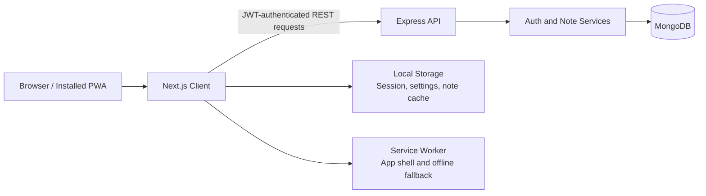

# Notezy

> A polished, desktop-inspired personal productivity app for capturing, organizing, and revisiting notes.

[](https://nextjs.org/)
[](https://www.typescriptlang.org/)
[](https://www.mongodb.com/)
[](https://expressjs.com/)

Notezy combines a tactile sticky-note interface with practical productivity features: rich-text editing, autosave, categories, search, themes, keyboard shortcuts, responsive layouts, and installable PWA support.

[**Live Demo**](https://notezy-app.vercel.app/) · [**Try Demo Account**](https://notezy-app.vercel.app/login) · [**Source Code**](https://github.com/sammy00/Notezy)

## Live Demo

**Live frontend:** [https://notezy-app.vercel.app/](https://notezy-app.vercel.app/)

### Demo Access

Open the [Notezy login screen](https://notezy-app.vercel.app/login) and select **🚀 Try Demo Account**. No signup or credentials are required.

The demo endpoint creates the shared demo account when needed and restores three curated sample notes whenever a new demo session begins.

## Screenshots

### Demo Workspace


### Rich Note Editor


### One-Click Demo Login


## Features

- Secure email/password authentication with JWT sessions
- Email-based password recovery with hashed, single-use reset tokens
- Resend-powered reset emails with 15-minute link expiration
- One-click demo workspace with seeded sample content
- User-specific notes backed by MongoDB
- Rich-text note editor with formatting tools
- Debounced autosave with Saving, Synced, and Offline states
- Manual save with `Ctrl/Cmd + S`
- Full-text note search with `Ctrl/Cmd + K`
- Create-note shortcut with `Ctrl/Cmd + N`
- Categories, favorites, pinned notes, tasks, trash, and restore
- Live note, category, favorite, pinned, and task counts
- List and grid views with animated note cards
- Light and dark themes
- Settings, profile, usage statistics, shortcuts, and notifications panels
- Toast notifications for important workspace actions
- Responsive desktop, tablet, and mobile layouts
- Mobile bottom navigation and off-canvas sidebar
- Installable PWA with offline fallback and app icons

## Tech Stack

### Frontend

| Technology | Purpose |
| --- | --- |
| Next.js 16 | App Router, routing, metadata, and production builds |
| React 19 | Component-driven UI and application state |
| TypeScript | End-to-end type safety |
| Tailwind CSS 4 | Utility styling and responsive composition |
| Framer Motion | Sidebar, editor, card, modal, and toast animations |
| Lucide React | Consistent interface icons |

### Backend

| Technology | Purpose |
| --- | --- |
| Node.js | Server runtime |
| Express 5 | REST API and middleware |
| MongoDB | Persistent user and note storage |
| Mongoose | Schemas, validation, and database access |
| JSON Web Tokens | Stateless authentication |
| bcryptjs | Password hashing |
| express-validator | Request validation |

## Architecture



The frontend and backend are separate applications inside one repository:

```text
notezy/
├── client/
│   ├── app/                 # Next.js routes and global styles
│   ├── components/          # Layout, authentication, and shared UI
│   ├── features/            # Auth and notes feature modules
│   ├── public/              # PWA worker, icons, and backgrounds
│   └── shared/              # Theme and toast infrastructure
├── server/
│   └── src/
│       ├── controllers/     # HTTP request handlers
│       ├── middleware/      # JWT authentication
│       ├── models/          # Mongoose User and Note schemas
│       ├── routes/          # Auth and note endpoints
│       └── services/        # Authentication and note business logic
└── docs/screenshots/        # README media
```

## Local Setup

### Prerequisites

- Node.js 20 or newer
- npm
- A local or hosted MongoDB database

### 1. Clone the repository

```bash
git clone https://github.com/sammy00/Notezy.git
cd Notezy
```

### 2. Install dependencies

```bash
npm install
npm install --prefix client
npm install --prefix server
```

### 3. Configure the client

Copy `client/.env.example` to `client/.env.local`:

```env
NEXT_PUBLIC_API_URL=http://localhost:5050
```

### 4. Configure the server

Copy `server/.env.example` to `server/.env` and provide your own secrets:

```env
MONGO_URI=mongodb://127.0.0.1:27017/notezy
JWT_SECRET=replace-with-a-long-random-secret
CLIENT_URL=http://localhost:3000
PORT=5050
RESEND_API_KEY=re_your_api_key
EMAIL_FROM=Notezy <noreply@your-verified-domain.com>
```

Never commit real environment variables or production secrets.

### Password Reset Email Setup

Notezy uses [Resend](https://resend.com/) to deliver password-reset emails.

1. Create a Resend account and verify a sending domain.
2. Create an API key.
3. Set `RESEND_API_KEY` and `EMAIL_FROM` on the deployed API.
4. Set `CLIENT_URL` to the frontend URL so email links return users to Notezy:

```env
CLIENT_URL=https://notezy-app.vercel.app
EMAIL_FROM=Notezy <noreply@your-verified-domain.com>
```

Reset tokens are hashed before database storage, expire after 15 minutes, and are deleted after a successful password change.

### 5. Start Notezy

```bash
npm run dev
```

- Frontend: [http://localhost:3000](http://localhost:3000)
- API: [http://localhost:5050](http://localhost:5050)

## Available Scripts

| Command | Description |
| --- | --- |
| `npm run dev` | Run the client and API together |
| `npm run build` | Create production builds for both applications |
| `npm run build:client` | Build only the Next.js client |
| `npm run build:server` | Compile only the Express API |
| `npm run lint` | Run the frontend ESLint checks |
| `npm run start:server` | Start the compiled API |

## API Overview

```text
POST   /api/auth/signup
POST   /api/auth/login
POST   /api/auth/demo
POST   /api/auth/forgot-password
POST   /api/auth/reset-password
GET    /api/auth/me

GET    /api/notes
POST   /api/notes
GET    /api/notes/:id
PATCH  /api/notes/:id
DELETE /api/notes/:id
```

Protected note routes accept the JWT in the `auth-token` header or as a Bearer token.

## Production Notes

- Deploy `client` to a Next.js-compatible host such as Vercel.
- Deploy `server` using the included Railway configuration or another Node.js host.
- Set `NEXT_PUBLIC_API_URL` to the deployed API URL.
- Set `CLIENT_URL` to the deployed frontend origin.
- Add `RESEND_API_KEY` and a verified `EMAIL_FROM` address to the API environment.
- PWA installation requires HTTPS in production.

## Author

Built by [Rohit Sanjay](https://github.com/sammy00).
